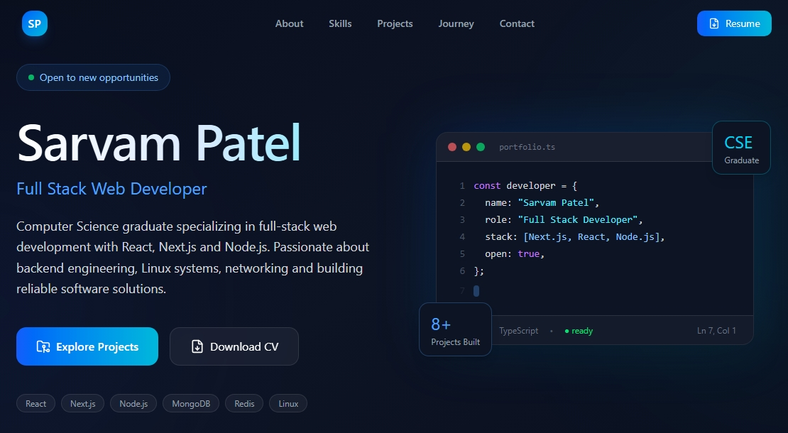

# 🚀 Sarvam Patel - Developer Portfolio




A modern, responsive developer portfolio built with **Next.js 16**, **React**, **TypeScript**, **Tailwind CSS**, and **Framer Motion**.

Designed to showcase my projects, technical skills, experience, and resume while maintaining excellent performance, accessibility, and SEO.

## 🌐 Live Demo

🔗 https://sarvam-patel.vercel.app


## ✨ Features

- ⚡ Built with Next.js 16 App Router
- 🎨 Modern responsive UI
- 🌙 Dark glassmorphism design
- 📱 Mobile-first layout
- ✨ Smooth Framer Motion animations
- 📄 Resume download
- 🔍 SEO optimized
- 📈 Structured Data (Schema.org)
- 🗺️ Sitemap & Robots.txt
- 📊 Vercel Analytics & Speed Insights
- ♿ Accessibility optimized
- 🚀 Optimized performance


## 🛠 Tech Stack

### Frontend

- Next.js
- React
- TypeScript
- Tailwind CSS
- Framer Motion

### Icons

- Lucide React
- React Icons

### Deployment

- Vercel


## 📂 Project Structure

```text
Portfolio
├───public
└───src
    ├───app
    ├───components
    ├───data
    ├───hooks
    └───types
```


## 🚀 Running Locally

Clone the repository

```bash
git clone https://github.com/CoreTech7704/sarvam-portfolio.git
```

Go to the project

```bash
cd sarvam-portfolio
```

Install dependencies

```bash
pnpm install
```

Run development server

```bash
pnpm dev
```

Open

```
http://localhost:3000
```


## 📈 Lighthouse Scores

| Category | Score |
|----------|------:|
| Performance | 95–100 |
| Accessibility | 100 |
| Best Practices | 100 |
| SEO | 100 |


## 📬 Contact

📧 **Email** :- sarvampatel953@gmail.com

💼 **LinkedIn** :- https://www.linkedin.com/in/sarvam-patel/

💻 **GitHub** :- https://github.com/CoreTech7704

🌐 **Portfolio** :- https://sarvam-patel.vercel.app


## 📄 License

This project is open source and available under the MIT License.